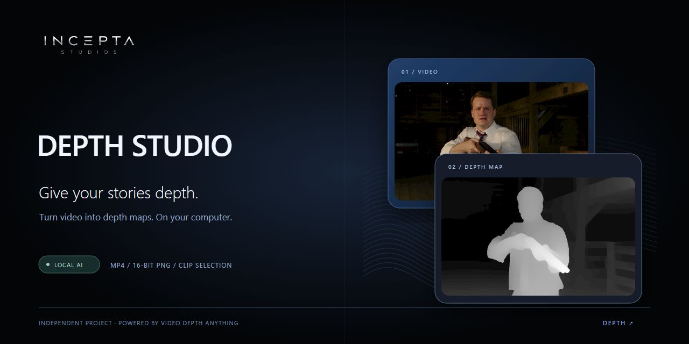

# Depth Studio

A free local Windows app by **Incepta Studios** that turns video into relative depth maps. Powered by **Video Depth Anything Small**.

**[Download the Windows installer](https://github.com/incepta-studio/incepta-studio-depth/releases/latest)**

## Features

- Select a clip using start/end sliders, seconds or the current frame.
- Preview source and depth together.
- Fast, Balanced and Detailed processing settings.
- Resolution presets from 360p to 4K, or source dimensions; no upscaling.
- Grayscale or Inferno depth MP4; optional 16-bit PNG frame archive.
- Local GPU processing, progress and cancellation. CPU fallback.

## Install

Windows 10/11, 64-bit. Download `incepta_studio-Setup-0.1.4.exe` from Releases, install and launch **incepta_studio**. Python, the Small checkpoint and runtime libraries are bundled; no model download is required. The offline installer is about 2 GB. An NVIDIA driver is required for CUDA acceleration.

This is an **unsigned early release**. Tested on Windows with NVIDIA RTX 3060; other GPUs and CPU performance have not been validated. No macOS installer is available yet.

## Depth and privacy

Depth is relative, not a distance in meters. Near objects appear lighter. PNG depth uses one normalization range across the selected clip. Videos are processed locally; there is no cloud upload or subscription.

## Credits and licenses

Interface and local integration: **Incepta Studios**, an independent project. This is not an official DepthAnything or ByteDance product.

Model and upstream engine: [Video Depth Anything](https://github.com/DepthAnything/Video-Depth-Anything), authors of the project / ByteDance. Only **Small** is bundled, under Apache-2.0. Base and Large are not included and have separate noncommercial license terms.

Runtime components retain their own licenses, including FFmpeg GPLv3. See [third-party notices](THIRD_PARTY_NOTICES.md) and [Apache-2.0](LICENSE). The application also provides an About and licenses section.

The cover uses a supplied film still to demonstrate depth estimation; the application and model licenses do not grant rights to that film imagery.
